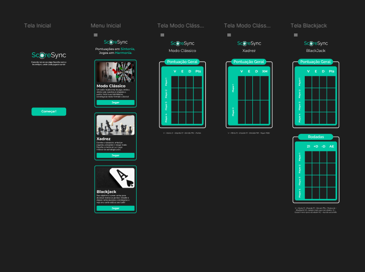

# 🔃 ScoreSync
ScoreSync é uma plataforma dedicada a oferecer uma experiência única de jogos e competições, otimizando jogatinas e proporcionando um ambiente interativo e divertido.  Desenvolvido com foco na diversão e na competição saudável, o ScoreSync oferece uma variedade de modalidades.
## Recursos Principais
- **Variedade de Modos de Jogo:**
Explore diversos modos para atender a diferentes preferências, garantindo uma experiência envolvente e desafiadora.

- **Acompanhamento Dinâmico de Pontuações:**
Mantenha-se atualizado com suas pontuações em tempo real, desafiando amigos para competições emocionantes. A sincronização instantânea torna cada partida única.

- **Interface Intuitiva:**
A interface do ScoreSync é amigável e intuitiva, proporcionando facilidade de navegação para uma experiência de usuário agradável.

## 🖥️ O Projeto

## 📂 Status do projeto
O projeto em andamento.

## ⚙️ Tecnologias
As seguintes ferramentas estão sendo utilizadas na construção do projeto:
- HTML5
- CSS3
- Javascript
